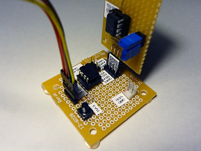

## I2C EEPROMのダンプ表示と書き込みツール (PIC 12F1822)<!-- omit in toc -->

[Home](https://oasis3855.github.io/webpage/) > [Software](https://oasis3855.github.io/webpage/software/index.html) > [Software Download](https://oasis3855.github.io/webpage/software/software-download.html) > [pic-i2c-lib](../README.md) > ***i2c-eeprom-dump*** (this page)

<br />
<br />

Last Updated : Feb. 2013

- [ソフトウエアのダウンロード](#ソフトウエアのダウンロード)
- [概要](#概要)
  - [主な機能](#主な機能)
  - [コマンド書式](#コマンド書式)
- [回路図・部品表](#回路図部品表)
- [完成写真およびシリアル出力例](#完成写真およびシリアル出力例)
- [動作確認済み開発環境](#動作確認済み開発環境)
- [バージョン情報](#バージョン情報)
- [ライセンス](#ライセンス)

<br />
<br />

## ソフトウエアのダウンロード

-  [このGitHubリポジトリを参照する（ソースコード）](./)

※ ```i2c-lib.c``` , ```serial-lib.c``` は I2Cバス, シリアルバス通信用の共通ライブラリ。```common-lib.c``` は数値を文字列に変換する共通ライブラリ。


## 概要

I2C接続EEPROMのダンプ表示と書き込みを行うシリアル接続ユニット

### 主な機能

- 動作電圧 3.3V, 5.0V
- シリアル接続（RS232C接続）によるPCからのコントロール
- 指定範囲のダンプ表示、指定バイトによる上書き 

### コマンド書式

機能 | コマンド書式 | 引数の説明
---|---|---
アドレス付き表示（ダンプ） | R[addr],[page] | addr=開始アドレス, page=表示ページ数（1ページ=32bytes）
表示（ダンプ） | H[addr],[page] | addr=開始アドレス, page=表示ページ数（1ページ=32bytes）
1バイト書き込み | W[addr],[data] | addr=開始アドレス, data=書きこみデータ（00〜FF）
指定バイト数書き込み | M[addr],[data],[count] | addr=開始アドレス, data=書きこみデータ（00〜FF）, count=書き込みバイト数

数値は全て16進数として解釈される。数値を省略すると、0が指定されているものと解釈する。 

## 回路図・部品表 


- [BSch3V用回路図ファイルをダウンロードする](../readme_pics/eeprom-dump-sch.ce3)

名称 | 型番・仕様 | 個数・価格
---|---|---
PICマイコン | 12F1822 | 1個（145円）
I2C EEPROM | 24LC64 | 1個（80円）
炭素皮膜抵抗 | 10kΩ | 1個（5円） 

## 完成写真およびシリアル出力例 



<pre>
<i> ← 電源ON直後は0000番地から2page(2*32bytes)表示</i>
EEPROM util
[R|H][adr],[pg], W[adr],[dat], M[adr],[dat],[cnt]
dmp
adr 0000,pg 0002
0000: DD DD 20 80 80 FF FF FF FF FF FF FF FF FF FF FF 
0010: A0 A0 A0 A0 A0 00 00 00 00 B0 B0 B0 CC 00 00 00 
0020: 00 00 00 00 00 00 00 00 00 00 00 00 00 00 00 00 
0030: 00 00 00 00 00 00 00 00 00 00 00 00 00 00 00 00 

R90,2   <i>← 0090番地から2page(2*32bytes)表示</i>
EEPROM util
[R|H][adr],[pg], W[adr],[dat], M[adr],[dat],[cnt]
dmp
adr 0090,pg 0002
0090: 00 00 00 00 00 00 00 00 00 00 00 00 00 00 00 00 
00A0: 00 00 00 00 00 00 00 00 00 00 00 00 00 00 00 00 
00B0: FF FF FF FF FF FF FF FF FF FF FF FF FF FF FF FF 
00C0: FF FF FF FF FF FF FF FF FF FF FF FF FF FF FF FF 

W90,12   <i>← 0090番地に12を書き込み</i>
EEPROM util
[R|H][adr],[pg], W[adr],[dat], M[adr],[dat],[cnt]
wrt
adr 0090,dat 12
done

MA0,34,4   <i>← 00A0番地から4バイト分に34を書き込み</i>
EEPROM util
[R|H][adr],[pg], W[adr],[dat], M[adr],[dat],[cnt]
wrt
adr 00A0,cnt 0004,dat 34
done

R90,2
EEPROM util
[R|H][adr],[pg], W[adr],[dat], M[adr],[dat],[cnt]
dmp
adr 0090,pg 0002
0090: 12 00 00 00 00 00 00 00 00 00 00 00 00 00 00 00 
00A0: 34 34 34 34 00 00 00 00 00 00 00 00 00 00 00 00 
00B0: FF FF FF FF FF FF FF FF FF FF FF FF FF FF FF FF 
00C0: FF FF FF FF FF FF FF FF FF FF FF FF FF FF FF FF 
</pre>

## 動作確認済み開発環境

- Microchip MPLAB X IDE ver 1.30
- Microchip MPLAB X IDE ver 1.60
- Microchip MPLAB XC8 ver 1.01
- Microchip MPLAB XC8 ver 1.12 

## バージョン情報

- Version 2013/02/03

## ライセンス

このスクリプトは [GNU General Public License v3ライセンスで公開する](https://gpl.mhatta.org/gpl.ja.html) フリーソフトウエア

※ 配布ソースコード等に書かれているライセンス条項は撤回し、上述GNU General Public License v3ライセンスにて配布する。
