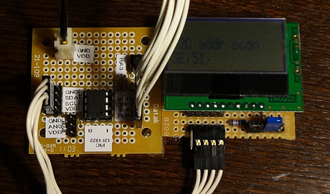

## I2Cデバイス アドレスをスキャンする (PIC 12F1822)<!-- omit in toc -->

[Home](https://oasis3855.github.io/webpage/) > [Software](https://oasis3855.github.io/webpage/software/index.html) > [Software Download](https://oasis3855.github.io/webpage/software/software-download.html) > [pic-i2c-lib](../README.md > ***i2c-scan*** (this page)

<br />
<br />

Last Updated : Jan. 2013

- [ソフトウエアのダウンロード](#ソフトウエアのダウンロード)
- [概要](#概要)
  - [主な機能](#主な機能)
  - [回路図・部品表](#回路図部品表)
  - [完成写真およびシリアル出力例](#完成写真およびシリアル出力例)
  - [動作確認済み開発環境](#動作確認済み開発環境)
- [バージョン情報](#バージョン情報)
- [ライセンス](#ライセンス)

<br />
<br />

## ソフトウエアのダウンロード

-  [このGitHubリポジトリを参照する（ソースコード）](./)

※ ```i2c-lib.c``` , ```serial-lib.c``` は I2Cバス, シリアルバス通信用の共通ライブラリ

## 概要

I2Cバスに接続された全てのデバイスのアドレス一覧を、液晶表示と同時にシリアル出力するユニットの製作。

### 主な機能

- 動作電圧 3.3V, 5.0V
- LCD表示（スキャン中表示、結果表示）
- シリアル接続（RS232C接続）によるPCへのデータ転送
- トリガボタンまたは端末からのリターンキー入力により再スキャン 

###  回路図・部品表


- [BSch3V用回路図ファイルをダウンロードする](readme_pics/i2c-scanner.CE3)

名称|型番・仕様|個数・価格
---|---|---
PICマイコン|12F1822|1個（145円）
I2C EEPROM|24LC64|1個（80円）
I2C液晶|Strawberry Linux SB1602B|1個（700円）
炭素皮膜抵抗|10kΩ|1個（5円）
炭素皮膜抵抗|1kΩ|1個（5円）
タクトスイッチ| |1個（35円） 

### 完成写真およびシリアル出力例 



```

I2C addr scan
 --  --  --  --  --  --  --  --  08  09  0A  0B  0C  0D  0E  0F
 10  11  12  13  14  15  16  17  18  19  1A  1B  1C  1D  1E  1F
 20  21  22  23  24  25  26  27  28  29  2A  2B  2C  2D  2E  2F
 30  31  32  33  34  35  36  37  38  39  3A  3B  3C  3D [3E] 3F
 40  41  42  43  44  45  46  47  48  49  4A  4B  4C  4D  4E  4F
 50 [51] 52  53  54  55  56  57  58  59  5A  5B  5C  5D  5E  5F
 60  61  62  63  64  65  66  67  68  69  6A  6B  6C  6D  6E  6F
 70  71  72  73  74  75  76  77  --  --  --  --  --  --  --  --
 --  --  --  --  --  --  --  --  --  --  --  --  --  --  --  --
 --  --  --  --  --  --  --  --  --  --  --  --  --  --  --  --
 --  --  --  --  --  --  --  --  --  --  --  --  --  --  --  --
 --  --  --  --  --  --  --  --  --  --  --  --  --  --  --  --
 --  --  --  --  --  --  --  --  --  --  --  --  --  --  --  --
 --  --  --  --  --  --  --  --  --  --  --  --  --  --  --  --
 --  --  --  --  --  --  --  --  --  --  --  --  --  --  --  --
 --  --  --  --  --  --  --  --  --  --  --  --  --  --  --  --
found:3E, 51,
```

### 動作確認済み開発環境

- Microchip MPLAB X IDE ver 1.30
- Microchip MPLAB XC8 ver 1.01 

## バージョン情報

- Version 2013/01/14

## ライセンス

このスクリプトは [GNU General Public License v3ライセンスで公開する](https://gpl.mhatta.org/gpl.ja.html) フリーソフトウエア

※ 配布ソースコード等に書かれているライセンス条項は撤回し、上述GNU General Public License v3ライセンスにて配布する。
