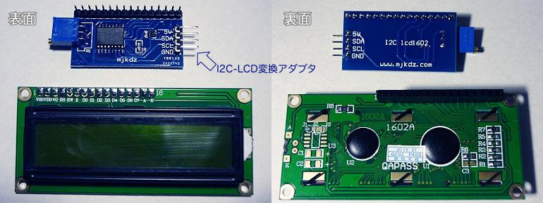
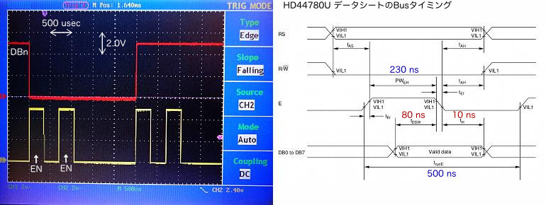
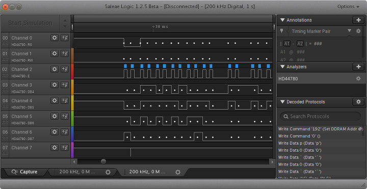
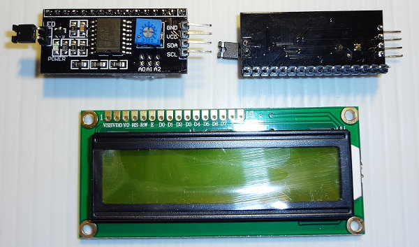

## I2C接続キャラクタLCDに文字列表示 (PIC 12F1822)<!-- omit in toc -->

[Home](https://oasis3855.github.io/webpage/) > [Software](https://oasis3855.github.io/webpage/software/index.html) > [Software Download](https://oasis3855.github.io/webpage/software/software-download.html) > [pic-i2c-lib](../) > ***i2c-lcd*** (this page)

<br />
<br />

Last Updated : Feb. 2016

- [ソフトウエアのダウンロード](#ソフトウエアのダウンロード)
- [概要](#概要)
- [信号タイミング](#信号タイミング)
- [LCDデバイス（機種）別](#lcdデバイス機種別)
  - [Strawberry Linux SB1602B](#strawberry-linux-sb1602b)
  - [I2C LCD 変換アダプタ mjkdz I2C lcd1602 (第一世代版)](#i2c-lcd-変換アダプタ-mjkdz-i2c-lcd1602-第一世代版)
  - [I2C LCD 変換アダプタ CEG003400](#i2c-lcd-変換アダプタ-ceg003400)
- [ライセンス](#ライセンス)

<br />
<br />

## ソフトウエアのダウンロード

- [このGitHubリポジトリを参照する（ソースコード）](./)

※ ```i2c-lib.c``` , ```serial-lib.c``` は I2Cバス, シリアルバス通信用の共通ライブラリ

## 概要

I2C接続のキャラクタLCDデバイスに文字列を表示するソフトウエア

## 信号タイミング

LCDドライバICで指定されている信号タイミングの標準的な時間は、ENピン前後の信号伝達を保証する部分では1マイクロ秒程度、1つのコマンドが送信さた後のウエイト時間が30マイクロ秒程度。

それに対して、I2Cバスを用いて伝送した場合は1回のHi/Lo伝送に掛かる時間は200マイクロ秒程度となるはずだ（下図参照）。 


I2Cバスを用いてLCDを制御する限りにおいては、ウエイト時間をPIC側のプログラム内で意識して指定する必要性は殆ど無い（数十ミリ秒を必要とするリセット後のウエイト時間など一部の例外を除く）。ここで公開しているライブラリ関数には何らかの参考になると考えて、マイクロ秒単位のウエイト時間も指定している。 

## LCDデバイス（機種）別

### Strawberry Linux SB1602B

**基礎データ**

- 販売者のWeb : [I2C低電圧キャラクタ液晶モジュール（16x2行）SB1602B](http://strawberry-linux.com/catalog/items?code=27001)
- ドライバIC : Sitronix ST7032互換
- Device Address : 0x3e
- 動作可能電圧 : 3.3V, 5V 

**動作電圧によるライブラリの変更箇所**

Booster Circuitを3.3Vの場合はON（ST7032_POWER_BOOST_L）に、5Vの場合はOFF（ST7032_POWER_BOOST_L）とする。

ボルテージフォロアは3.3V, 5V共にON（ST7032_FOLLOWER_H）とする。 

***i2c-lcdlib-strawberry1602b.c のLCD初期化部抜粋***
```C
// I2C LCD initialize (I2C液晶の初期化)
void i2c_lcd_init(void)
{
 
//〜 中略 〜
 
    // Contrast set(low byte)=0x8 (IS=1 mode)
	i2c_lcd_send_command(0x70 | (LCD_CONTRAST & 0x0f));
	__delay_us(30);     // Wait 26.3 us
 
    // Contrast set(high byte)=0x2, Icon=ON, Booster circuit=OFF (IS=1 mode)
	i2c_lcd_send_command(0x50 | ST7032_POWER_BOOST_L | ST7032_ICON_L | ((LCD_CONTRAST >> 4) & 0x03));
	__delay_us(30);     // Wait 26.3 us
 
    // follower circuit=ON, Amplified Ratio (IS=1 mode)
	i2c_lcd_send_command(0x60 | ST7032_FOLLOWER_H | ST7032_V0_AMP);
	__delay_ms(220);     // Wait 200 ms
 
//〜 中略 〜
 
}
```

###  I2C LCD 変換アダプタ mjkdz I2C lcd1602 (第一世代版) 

**基礎データ**

- 製品名 : MJK電子 Arduino IIC/I2C/接口 LCD1602转接板
- IC : Philips PCF8574互換と思われる
- Device Address : 0x20（第2世代は0x20〜0x27の範囲で設定可能）
- 動作可能電圧 : 3.3V, 5V
- ターゲットLCD : LCD1602, LCD1604, LCD2004 （4 bit mode only） 



変換アダプタ（上）と1602 LCD（下）

この変換アダプタはI2Cで送信した8ビット長のデータを、単にLCD側端子の各ピンに割り当てているだけと判明。PICマイクロコントローラ側でデータパルスとENパルスの組み合わせでデータ伝送するLCD制御信号のタイミングを取ってやる必要がある。

この変換アダプタを入手した時に得た情報ではI2Cアドレスは0x27で、サンプルプログラムも提供されなかった。中国人いい加減すぎる…

I2Cで送信するデータ（8bit）とLCD側端子の対応表

BL | RS | RW | EN | D7 | D6 | D5 | D4
---|---|---|---|---|---|---|---

バックライト（BL）ビットは、1のときバックライト消灯、0のとき点灯という動作となる。 

**出力波形と推奨Busタイミングの比較**



ENピンの電圧がHiからLoに落ちる前後でデータ転送（認識）が行われるが、最低80nsecや10nsecというのはI2C経由の制御では十分満たすことが出来る。

S | Address(7bit) | R/W | A | Data(8bit) | A | P
---|---|---|---|---|---|---

**ENピンのHi/Lo変化とデータ伝送**

LCD_ENビットを立てたデータと、そうでないデータを連続して送信する。ロジック・アナライザで観察したENピンのビット変化（水色で着色）で、データが転送される（・）様子を次に示す。 



***i2c-lcdlib-mjkdz.c のデータ送信部抜粋***

```C
// send data to I2C LCD (I2C液晶にデータを送信する) 4 bit mode
void i2c_lcd_send_data(unsigned char data){
    unsigned char lcddata;
 
    // Put the Upper 4 bits data
    // Write Enable Pulse E: Hi
    lcddata = (data>>4) & 0x0f | LCD_BACKLIGHT | LCD_RS;
    i2c_lcd_send_common(lcddata | LCD_EN);
    __delay_us(2);      // PWeh=0.23 us (HD44780U), Tpw=0.14 us (SD1602V)
 
    // Write Enable Pulse E: Hi -> Lo
    i2c_lcd_send_common(lcddata & ~LCD_EN);
    __delay_us(2);      // Tcyce-PWeh=0.5-0.23=0.27 us (HD44780U), Tc-Tpw=1.2-0.14=1.06 us (SD1602V)
 
    // Put the Lower 4 bit data
    lcddata = (data & 0x0f) | LCD_BACKLIGHT | LCD_RS;
    i2c_lcd_send_common(lcddata | LCD_EN);
    __delay_us(2);
 
    i2c_lcd_send_common(lcddata & ~LCD_EN);
    __delay_us(2);
 
    __delay_us(50);     // Wait 37 us (HD44780U), 43 us (SD1602V)
}
```

### I2C LCD 変換アダプタ CEG003400 

**基礎データ**

- 販売者や製造者は不明。型番は「CEG003400」や「sainsmart LCD2004」「LCM1602」など様々
- IC : Philips PCF8574T
- Device Address : 0x27（A0,A1,A2のパターンをクローズすると0x20〜0x27で変化）
- 動作可能電圧 : 3.3V, 5V
- ターゲットLCD : LCD1602, LCD1604, LCD2004 （4 bit mode only） 



変換アダプタ（上）と1602 LCD（下）

**I2Cで送信するデータ（8bit）とLCD側端子の対応表**

D7 | D6 | D5 | D4 | BL | EN | RW | RS
---|---|---|---|---|---|---|---

バックライト（BL）ビットは、1のときバックライト点灯、0のとき消灯という動作となる。 

## ライセンス

このスクリプトは [GNU General Public License v3ライセンスで公開する](https://gpl.mhatta.org/gpl.ja.html) フリーソフトウエア

※ 配布ソースコード等に書かれているライセンス条項は撤回し、上述GNU General Public License v3ライセンスにて配布する。
